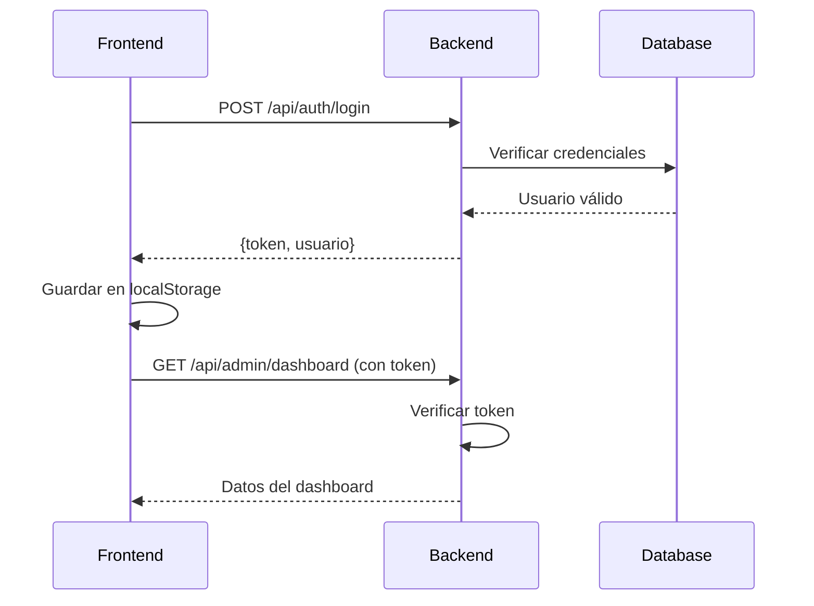
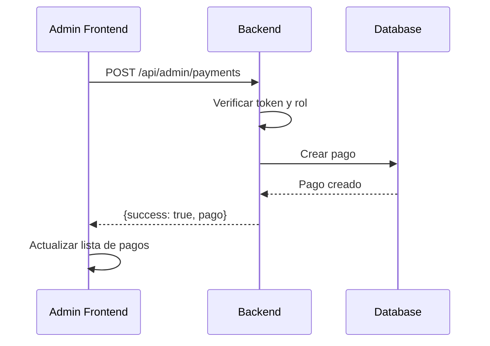
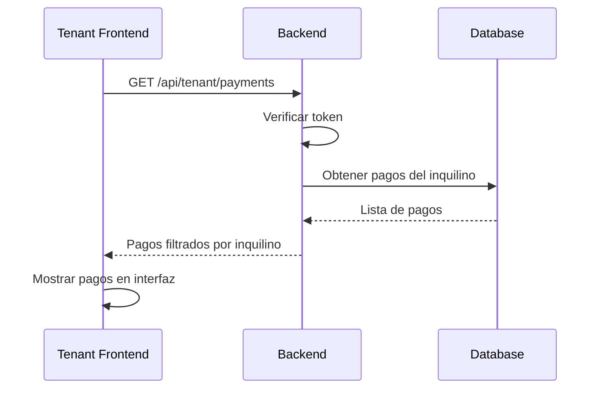

# 🏢 DepaManager - Documentación Técnica Completa

## 📋 Índice
1. [Arquitectura General](#arquitectura-general)
2. [Backend - Estructura y Funcionamiento](#backend---estructura-y-funcionamiento)
3. [Frontend - Estructura y Funcionamiento](#frontend---estructura-y-funcionamiento)
4. [Conexión Backend-Frontend](#conexión-backend-frontend)
5. [Base de Datos](#base-de-datos)
6. [Autenticación y Autorización](#autenticación-y-autorización)
7. [Estado de Implementación](#estado-de-implementación)
8. [Comandos de Desarrollo](#comandos-de-desarrollo)

## 🏗️ Arquitectura General

DepaManager es un **monorepo** que contiene dos aplicaciones principales:

```
DepaManager/
├── Backend/     → API REST (Node.js + Express + Sequelize + MySQL)
└── frontend/    → SPA (React + Vite + TailwindCSS)
```

### Flujo de Comunicación
```
[Frontend React] ←→ [API REST Backend] ←→ [Base de Datos MySQL]
     Puerto 5173        Puerto 3000         Puerto 3306
```

---

## 🔧 Backend - Estructura y Funcionamiento

### 📁 Estructura de Directorios

```
Backend/
├── src/
│   ├── index.js                 → ✅ Punto de entrada principal (COMPLETO)
│   ├── config/
│   │   └── sequelize.js         → ✅ Configuración de BD (COMPLETO)
│   ├── models/                  → Modelos de Sequelize
│   │   ├── index.js             → ✅ Configuración de relaciones (COMPLETO)
│   │   ├── user.js              → ✅ Modelo Usuario (COMPLETO)
│   │   ├── payment.js           → ✅ Modelo Pagos (COMPLETO)
│   │   ├── tenant.js            → ✅ Modelo Inquilinos (COMPLETO)
│   │   ├── property.js          → ✅ Modelo Propiedades (COMPLETO)
│   │   ├── contract.js          → ✅ Modelo Contratos (COMPLETO)
│   │   ├── incident.js          → ✅ Modelo Incidencias (COMPLETO)
│   │   ├── provider.js          → ✅ Modelo Proveedores (COMPLETO)
│   │   ├── inventory.js         → ✅ Modelo Inventario (COMPLETO)
│   │   ├── applicant.js         → ✅ Modelo Postulantes (COMPLETO)
│   │   ├── vehicle.js           → ✅ Modelo Vehículos (COMPLETO)
│   │   ├── notification.js      → ✅ Modelo Notificaciones (COMPLETO)
│   │   └── report.js            → ✅ Modelo Reportes (COMPLETO)
│   ├── controllers/             → Lógica de negocio
│   │   ├── auth.controller.js   → ✅ Autenticación (COMPLETO - 313 líneas)
│   │   ├── admin.controller.js  → ✅ Panel Admin (COMPLETO - 657 líneas)
│   │   ├── tenant.controller.js → ✅ Panel Inquilino (COMPLETO)
│   │   ├── payment.controller.js→ ✅ Gestión Pagos (COMPLETO)
│   │   └── [otros].controller.js→ ❌ VACÍOS - Solo comentarios
│   ├── routes/                  → Definición de rutas
│   │   ├── auth.routes.js       → ✅ Rutas autenticación (COMPLETO)
│   │   ├── admin.routes.js      → ✅ Rutas panel admin (COMPLETO)
│   │   ├── tenant.routes.js     → ✅ Rutas panel inquilino (COMPLETO)
│   │   ├── payment.routes.js    → ✅ Rutas pagos (COMPLETO)
│   │   └── [otros].routes.js    → ❌ VACÍOS - Solo estructura
│   ├── middlewares/             → Middlewares personalizados
│   │   ├── auth.middleware.js   → ✅ Verificación JWT (COMPLETO)
│   │   ├── error.middleware.js  → ✅ Manejo de errores (COMPLETO - 141 líneas)
│   │   ├── upload.middleware.js → ❌ VACÍO - Por implementar
│   │   └── validation.middleware.js → ✅ Validaciones (COMPLETO - 193 líneas)
│   ├── services/                → Servicios auxiliares
│   │   ├── admin.service.js     → ❌ VACÍO - Solo comentarios
│   │   ├── email.service.js     → ❌ VACÍO - Solo comentarios
│   │   ├── payment.service.js   → ❌ VACÍO - Solo comentarios
│   │   ├── report.service.js    → ❌ VACÍO - Solo comentarios
│   │   └── upload.service.js    → ❌ VACÍO - Solo comentarios
│   └── utils/                   → Utilidades
│       ├── constants.js         → ✅ Constantes del sistema (COMPLETO - 171 líneas)
│       ├── formatters.js        → ❌ VACÍO - Solo comentarios
│       ├── helpers.js           → ❌ VACÍO - Solo comentarios
│       └── validators.js        → ❌ VACÍO - Solo comentarios
├── package.json                 → ✅ Dependencias y scripts (COMPLETO)
└── .env                         → ✅ Variables de entorno (REQUERIDO)
```

### 🚀 Archivo Principal: `src/index.js`

```javascript
const express = require('express');
const cors = require('cors');
require('dotenv').config();

const app = express();
const sequelize = require('./config/sequelize');

// ⚙️ Configuración de Middlewares
app.use(cors());                    // Permite peticiones desde el frontend
app.use(express.json());            // Parser JSON
app.use(express.urlencoded({ extended: true }));

// 📍 Configuración de Rutas
app.use('/api/auth', authRoutes);     // Autenticación y registro
app.use('/api/pagos', paymentRoutes); // Gestión de pagos
app.use('/api/tenant', tenantRoutes); // Panel inquilino
app.use('/api/admin', adminRoutes);   // Panel administrador

// 🎯 Sincronización automática de BD
sequelize.sync().then(() => {
  app.listen(PORT, () => {
    console.log(`Servidor corriendo en puerto ${PORT}`);
  });
});
```

**¿Qué hace este archivo?**
- Configura Express con CORS para permitir peticiones del frontend
- Conecta todas las rutas bajo el prefijo `/api/`
- **CLAVE**: `sequelize.sync()` crea/actualiza automáticamente las tablas basándose en los modelos
- No necesita migraciones manuales - Sequelize lee los modelos y ajusta la BD

### 🗄️ Modelos Principales (Completos)

#### 1. `models/user.js` - Usuario
```javascript
// Campos principales
{
  nombre: STRING(100),        // Nombre completo
  email: STRING(150),         // Email único
  password: STRING(255),      // Hash bcrypt
  telefono: STRING(20),       // Teléfono opcional
  rol: ENUM('propietario', 'inquilino'), // Rol del usuario
  activo: BOOLEAN             // Estado del usuario
}
```

#### 2. `models/tenant.js` - Inquilino
```javascript
// Relación con Usuario y Propiedad
{
  id_usuario: INTEGER,          // FK a usuarios
  propiedad_id: INTEGER,        // FK a propiedades
  fecha_inicio_contrato: DATE,  // Inicio del contrato
  fecha_fin_contrato: DATE,     // Fin del contrato
  monto_alquiler: DECIMAL(10,2) // Monto mensual
}
```

#### 3. `models/payment.js` - Pagos
```javascript
// Gestión de pagos mensualess
{
  inquilino_id: INTEGER,        // FK a inquilinos
  monto: DECIMAL(10,2),         // Monto del pago
  fecha_pago: DATE,             // Fecha de pago
  fecha_vencimiento: DATE,      // Fecha límite
  concepto: STRING(255),        // Descripción del pago
  estado: ENUM('pendiente', 'pagado', 'vencido')
}
```

### 🎛️ Controladores Principales (Completos)

#### 1. `controllers/auth.controller.js` - Autenticación
```javascript
// Funciones implementadas:
- login()           → Autentica usuario y devuelve JWT
- registro()        → Registra solo propietarios
- crearInquilino()  → Solo propietarios pueden crear inquilinos
- obtenerPerfil()   → Datos del usuario logueado
- obtenerDashboard()→ Dashboard personalizado por rol
```

#### 2. `controllers/admin.controller.js` - Panel Administrador
```javascript
// Funciones implementadas:
- getDashboard()           → Estadísticas generales
- getAllPayments()         → Lista todos los pagos
- createPayment()          → Crea pagos para inquilinos
- updatePayment()          → Actualiza pagos existentes
- deletePayment()          → Elimina (soft delete) pagos
- markPaymentAsPaid()      → Marca pago como pagado
- getTenants()             → Lista inquilinos con datos formateados
```

#### 3. `controllers/tenant.controller.js` - Panel Inquilino
```javascript
// Funciones implementadas:
- getDashboard()       → Dashboard del inquilino
- getPayments()        → Pagos del inquilino actual
- markPaymentAsPaid()  → Inquilino marca su pago
- getIncidents()       → Incidencias del inquilino
- getNotifications()   → Notificaciones del inquilino
```

### 🔐 Middleware de Autenticación

#### `middlewares/auth.middleware.js`
```javascript
// Middlewares implementados:
- verificarToken()      → Valida JWT en headers
- soloPropietarios()    → Solo usuarios con rol 'propietario'  
- soloInquilinos()      → Solo usuarios con rol 'inquilino'
- usuariosAutenticados()→ Cualquier usuario autenticado

// Uso en rutas:
router.post('/', verificarToken, soloPropietarios, crearPago);
router.get('/dashboard', verificarToken, usuariosAutenticados, getDashboard);
```

### 📡 Sistema de Rutas

#### Estructura de URLs:
```
/api/auth/*     → Autenticación (login, registro, perfil)
/api/admin/*    → Panel administrador (solo propietarios)
/api/tenant/*   → Panel inquilino (solo inquilinos)
/api/pagos/*    → Gestión de pagos (ambos roles)
```

---

## ⚛️ Frontend - Estructura y Funcionamiento

### 📁 Estructura de Directorios

```
frontend/
├── src/
│   ├── main.jsx                 → ✅ Punto de entrada (COMPLETO)
│   ├── app/
│   │   └── router/
│   │       └── AppRouter.jsx    → ✅ Configuración de rutas (COMPLETO - 96 líneas)
│   ├── pages/                   → Páginas principales
│   │   ├── public/              → Páginas públicas
│   │   │   ├── LandingPage.jsx  → ✅ Página inicial (COMPLETO)
│   │   │   ├── AdminAuthPage.jsx→ ✅ Login administrador (COMPLETO)
│   │   │   └── TenantLoginPage.jsx→ ✅ Login inquilino (COMPLETO)
│   │   ├── admin/               → Panel administrador
│   │   │   ├── Dashboard.jsx    → ✅ Dashboard admin (COMPLETO)
│   │   │   ├── PaymentsManagement.jsx → ✅ Gestión pagos (COMPLETO)
│   │   │   ├── IncidentsManagement.jsx → ⚠️ BÁSICO
│   │   │   └── TenantsManagement.jsx → ⚠️ BÁSICO
│   │   └── tenant/              → Panel inquilino
│   │       ├── Dashboard.jsx    → ✅ Dashboard inquilino (COMPLETO)
│   │       ├── Payments.jsx     → ✅ Ver pagos (COMPLETO)
│   │       ├── History.jsx      → ⚠️ BÁSICO
│   │       ├── Incidents.jsx    → ⚠️ BÁSICO
│   │       ├── Notifications.jsx→ ⚠️ BÁSICO
│   │       └── Profile.jsx      → ⚠️ BÁSICO
│   ├── components/              → Componentes reutilizables
│   │   ├── layout/
│   │   │   ├── TenantLayout.jsx → ✅ Layout inquilino (COMPLETO)
│   │   │   └── AdminLayout.jsx  → ❌ NO SE USA - Comentado
│   │   ├── auth/                → ❌ VACÍO - Directorio vacío
│   │   └── ui/                  → ❌ VACÍO - Directorio vacío
│   ├── services/                → Servicios de API
│   │   ├── adminService.js      → ✅ Servicio principal admin (COMPLETO - 260 líneas)
│   │   ├── tenantService.js     → ✅ Servicio principal inquilino (COMPLETO - 265 líneas)
│   │   ├── api/
│   │   │   ├── axiosConfig.js   → ✅ Configuración Axios (COMPLETO)
│   │   │   ├── auth.js          → ✅ Servicios autenticación (COMPLETO - 182 líneas)
│   │   │   ├── admin.js         → ❌ VACÍO - Archivo existe pero vacío
│   │   │   ├── tenant.js        → ✅ Servicios inquilino (COMPLETO)
│   │   │   ├── notifications.js → ❌ VACÍO - Archivo existe pero vacío
│   │   │   ├── payments.js      → ❌ VACÍO - Archivo existe pero vacío
│   │   │   ├── incidents.js     → ❌ VACÍO - Archivo existe pero vacío
│   │   │   ├── properties.js    → ❌ VACÍO - Archivo existe pero vacío
│   │   │   ├── providers.js     → ❌ VACÍO - Archivo existe pero vacío
│   │   │   ├── contracts.js     → ❌ VACÍO - Archivo existe pero vacío
│   │   │   ├── reports.js       → ❌ VACÍO - Archivo existe pero vacío
│   │   │   ├── applicants.js    → ❌ VACÍO - Archivo existe pero vacío
│   │   │   ├── vehicles.js      → ❌ VACÍO - Archivo existe pero vacío
│   │   │   └── tenants.js       → ❌ VACÍO - Archivo existe pero vacío
│   │   ├── storage/
│   │   │   ├── localStorage.js  → ❌ VACÍO - Archivo existe pero vacío
│   │   │   └── fileStorage.js   → ❌ VACÍO - Archivo existe pero vacío
│   │   └── upload/
│   │       └── fileUpload.js    → ❌ VACÍO - Archivo existe pero vacío
│   ├── contexts/                → Contextos React
│   │   ├── AuthContext.jsx      → ❌ VACÍO - Archivo existe pero vacío
│   │   ├── NotificationContext.jsx → ❌ VACÍO - Archivo existe pero vacío
│   │   └── ThemeContext.jsx     → ❌ VACÍO - Archivo existe pero vacío
│   ├── hooks/                   → Hooks personalizados
│   │   ├── auth/
│   │   │   └── useAuth.js       → ❌ VACÍO - Archivo existe pero vacío
│   │   ├── data/
│   │   │   ├── useApi.js        → ❌ VACÍO - Archivo existe pero vacío
│   │   │   ├── useCrud.js       → ❌ VACÍO - Archivo existe pero vacío
│   │   │   └── usePagination.js → ❌ VACÍO - Archivo existe pero vacío
│   │   ├── forms/
│   │   │   ├── useForm.js       → ❌ VACÍO - Archivo existe pero vacío
│   │   │   └── useValidation.js → ❌ VACÍO - Archivo existe pero vacío
│   │   └── ui/
│   │       ├── useModal.js      → ❌ VACÍO - Archivo existe pero vacío
│   │       ├── usePrint.js      → ❌ VACÍO - Archivo existe pero vacío
│   │       └── useToast.js      → ❌ VACÍO - Archivo existe pero vacío
│   ├── utils/                   → Utilidades Frontend
│   │   ├── constants/
│   │   │   ├── routes.js        → ❌ VACÍO - Archivo existe pero vacío
│   │   │   ├── roles.js         → ❌ VACÍO - Archivo existe pero vacío
│   │   │   └── status.js        → ❌ VACÍO - Archivo existe pero vacío
│   │   ├── config/
│   │   │   ├── appConfig.js     → ❌ VACÍO - Archivo existe pero vacío
│   │   │   └── themeConfig.js   → ❌ VACÍO - Archivo existe pero vacío
│   │   ├── errors/
│   │   │   ├── errorHandler.js  → ❌ VACÍO - Archivo existe pero vacío
│   │   │   └── errorMessages.js → ❌ VACÍO - Archivo existe pero vacío
│   │   └── helpers/
│   │       ├── dateUtils.js     → ❌ VACÍO - Archivo existe pero vacío
│   │       ├── fileUtils.js     → ❌ VACÍO - Archivo existe pero vacío
│   │       ├── formatters.js    → ❌ VACÍO - Archivo existe pero vacío
│   │       └── validators.js    → ❌ VACÍO - Archivo existe pero vacío
│   ├── features/                → Características específicas
│   │   └── reports/
│   │       ├── services/
│   │       │   └── reportsApi.js → ❌ VACÍO - Archivo existe pero vacío
│   │       └── hooks/
│   │           └── useReports.js → ❌ VACÍO - Archivo existe pero vacío
│   └── styles/
│       └── globals.css          → ✅ Estilos TailwindCSS (COMPLETO)
├── package.json                 → ✅ Dependencias React (COMPLETO)
└── vite.config.js              → ✅ Configuración Vite (COMPLETO)
```

### 🚀 Punto de Entrada: `main.jsx`

```jsx
import React from 'react';
import ReactDOM from 'react-dom/client';
import AppRouter from './app/router/AppRouter';
import './styles/globals.css';

ReactDOM.createRoot(document.getElementById('root')).render(
  <React.StrictMode>
    <AppRouter />
  </React.StrictMode>
);
```

**¿Qué hace?**
- Renderiza la aplicación React usando `AppRouter`
- Importa estilos globales de TailwindCSS
- Usa React 18 con `createRoot`

### 🛤️ Sistema de Rutas: `AppRouter.jsx`

```jsx
const AppRouter = () => {
  return (
    <Router>
      <Routes>
        {/* Rutas públicas */}
        <Route path="/" element={<LandingPage />} />
        <Route path="/admin-auth" element={<AdminAuthPage />} />
        <Route path="/tenant-login" element={<TenantLoginPage />} />

        {/* Rutas protegidas - ADMIN */}
        <Route path="/admin-dashboard" element={
          <ProtectedRoute requiredRole="propietario">
            <AdminDashboard />
          </ProtectedRoute>
        } />

        {/* Rutas protegidas - INQUILINO */}
        <Route path="/tenant/*" element={
          <ProtectedRoute requiredRole="inquilino">
            <TenantLayout />
          </ProtectedRoute>
        } />
      </Routes>
    </Router>
  );
};
```

**Sistema de Protección:**
- `ProtectedRoute` verifica autenticación y rol
- Redirige a `/` si no está autenticado
- Redirige a `/` si el rol no coincide

### 📡 Configuración de API: `services/api/axiosConfig.js`

```javascript
import axios from 'axios';

const api = axios.create({
  baseURL: 'http://localhost:3000/api',  // URL del backend
  timeout: 10000,
  headers: {
    'Content-Type': 'application/json',
  },
});

// Interceptor para añadir token automáticamente
api.interceptors.request.use((config) => {
  const token = localStorage.getItem('token');
  if (token) {
    config.headers.Authorization = `Bearer ${token}`;
  }
  return config;
});

// Interceptor para manejar errores 401 (no autorizado)
api.interceptors.response.use(
  (response) => response,
  (error) => {
    if (error.response?.status === 401) {
      localStorage.removeItem('token');
      localStorage.removeItem('usuario');
      window.location.href = '/';
    }
    return Promise.reject(error);
  }
);
```

**¿Qué hace?**
- Configura base URL del backend (`http://localhost:3000/api`)
- **AUTOMÁTICO**: Añade token JWT a todas las peticiones
- **AUTOMÁTICO**: Si recibe 401, limpia localStorage y redirige a inicio
- Timeout de 10 segundos

---

## 🔗 Conexión Backend-Frontend

### 🔄 Flujo de Autenticación



### 📊 Flujo de Gestión de Pagos



### 🏠 Flujo de Panel Inquilino



---

## 🗃️ Base de Datos

### 📋 Esquema Automático

**IMPORTANTE**: No usamos migraciones manuales. Sequelize crea/actualiza las tablas automáticamente basándose en los modelos.

### 🔗 Relaciones Principales

```javascript
// Definidas en models/index.js
Usuario (1) ←→ (1) Inquilino
Propiedad (1) ←→ (N) Inquilino  
Inquilino (1) ←→ (N) Pago
```

### 📊 Tablas Generadas Automáticamente

#### `usuarios`
```sql
CREATE TABLE usuarios (
  id INT AUTO_INCREMENT PRIMARY KEY,
  nombre VARCHAR(100) NOT NULL,
  email VARCHAR(150) UNIQUE NOT NULL,
  password VARCHAR(255) NOT NULL,
  telefono VARCHAR(20),
  rol ENUM('propietario', 'inquilino') DEFAULT 'propietario',
  activo BOOLEAN DEFAULT true,
  createdAt TIMESTAMP DEFAULT CURRENT_TIMESTAMP,
  updatedAt TIMESTAMP DEFAULT CURRENT_TIMESTAMP ON UPDATE CURRENT_TIMESTAMP
);
```

#### `inquilinos`
```sql
CREATE TABLE inquilinos (
  id INT AUTO_INCREMENT PRIMARY KEY,
  id_usuario INT NOT NULL,
  propiedad_id INT,
  fecha_inicio_contrato DATE,
  fecha_fin_contrato DATE,
  monto_alquiler DECIMAL(10,2),
  FOREIGN KEY (id_usuario) REFERENCES usuarios(id)
);
```

#### `pagos`
```sql
CREATE TABLE pagos (
  id INT AUTO_INCREMENT PRIMARY KEY,
  inquilino_id INT NOT NULL,
  monto DECIMAL(10,2) NOT NULL,
  fecha_pago DATE,
  fecha_vencimiento DATE NOT NULL,
  concepto VARCHAR(255) DEFAULT 'Alquiler mensual',
  estado ENUM('pendiente', 'pagado', 'vencido') DEFAULT 'pendiente',
  FOREIGN KEY (inquilino_id) REFERENCES inquilinos(id)
);
```

---

## 🔐 Autenticación y Autorización

### 🔑 Sistema JWT

1. **Login**: Usuario envía credenciales
2. **Verificación**: Backend valida en BD
3. **Token**: Se genera JWT con datos del usuario
4. **Almacenamiento**: Frontend guarda token in localStorage
5. **Peticiones**: Axios automáticamente añade token a headers
6. **Validación**: Middleware verifica token en cada petición protegida

### 👥 Roles del Sistema

#### 🏢 Propietario (`rol: 'propietario'`)
- **Acceso**: Panel administrador (`/admin-dashboard`)
- **Permisos**:
  - Crear/gestionar inquilinos
  - Ver todos los pagos
  - Crear pagos para inquilinos
  - Gestionar incidencias
  - Enviar notificaciones

#### 🏠 Inquilino (`rol: 'inquilino'`)
- **Acceso**: Panel inquilino (`/tenant/*`)
- **Permisos**:
  - Ver sus propios pagos
  - Marcar pagos como pagados
  - Ver/reportar incidencias
  - Ver notificaciones
  - Actualizar perfil

### 🛡️ Middlewares de Protección

```javascript
// Solo propietarios
router.use(verificarToken, soloPropietarios);

// Solo inquilinos  
router.use(verificarToken, soloInquilinos);

// Cualquier usuario autenticado
router.use(verificarToken, usuariosAutenticados);
```

---

## 📊 Estado de Implementación

### ✅ **FUNCIONALIDADES COMPLETAMENTE IMPLEMENTADAS**

#### Backend - Núcleo Funcional
- **Autenticación completa**: Login, registro, JWT, roles
- **Panel de administrador**: Dashboard, gestión de pagos, inquilinos
- **Panel de inquilino**: Dashboard personalizado, visualización de pagos
- **Base de datos**: Todos los modelos Sequelize definidos
- **Middlewares críticos**: Autenticación, manejo de errores, validaciones
- **Constantes del sistema**: 171 líneas de configuraciones y mensajes

#### Frontend - Interfaces Funcionales
- **Sistema de rutas**: Protección por roles, navegación completa
- **Páginas principales**: Landing, login admin/inquilino, dashboards
- **Servicios API**: AdminService (260 líneas), TenantService (265 líneas)
- **Integración completa**: Axios configurado, interceptores, manejo de errores

### ⚠️ **ARCHIVOS ESTRUCTURADOS PERO VACÍOS**

#### 🔴 Backend - Controladores Pendientes
Los siguientes archivos están creados con estructura pero **solo contienen comentarios**:

```
controllers/
├── applicants.controller.js    → "Controlador CRUD de postulantes - Por implementar"
├── contract.controller.js      → "Controlador de Contratos - Por implementar"
├── incident.controller.js      → "Controlador de Incidencias - Por implementar"
├── inventory.controller.js     → "Controlador CRUD de inventario - Por implementar"
├── notifications.controller.js → "Controlador CRUD de notificaciones - Por implementar"
├── property.controller.js      → "Controlador de Propiedades - Por implementar"
├── providers.controller.js     → "Controlador CRUD de proveedores - Por implementar"
├── reports.controller.js       → "Controlador de Reportes - Por implementar"
├── tenants.controller.js       → "Rutas CRUD de inquilinos (para administradores) - Por implementar"
└── vehicles.controller.js      → "Controlador CRUD de vehículos - Por implementar"
```

**¿Qué código necesitan?**
Cada controlador necesita implementar funciones CRUD básicas siguiendo el patrón de los controladores existentes:
```javascript
// Ejemplo para incident.controller.js
const { Incidencia } = require('../models');

const crearIncidencia = async (req, res) => {
  try {
    const nuevaIncidencia = await Incidencia.create(req.body);
    res.json({ success: true, data: nuevaIncidencia });
  } catch (error) {
    res.status(500).json({ success: false, mensaje: error.message });
  }
};

module.exports = { crearIncidencia, obtenerIncidencias, actualizarIncidencia, eliminarIncidencia };
```

#### 🔴 Backend - Rutas Estructuradas
```
routes/
├── applicants.routes.js     → "Rutas CRUD de postulantes - Por implementar"
├── contract.routes.js       → "Rutas de Contratos - Por implementar" 
├── incident.routes.js       → "Rutas de Incidencias - Por implementar"
├── inventory.routes.js      → "Rutas CRUD de inventario - Por implementar"
├── notifications.routes.js  → "Rutas CRUD de notificaciones - Por implementar"
├── property.routes.js       → "Rutas de Propiedades - Por implementar"
├── providers.routes.js      → "Rutas CRUD de proveedores - Por implementar"
├── reports.routes.js        → "Rutas CRUD de reportes - Por implementar"
├── tenants.routes.js        → "Rutas CRUD de inquilinos (para administradores) - Por implementar"
└── vehicles.routes.js       → "Rutas CRUD de vehículos - Por implementar"
```

**¿Qué código necesitan?**
```javascript
// Ejemplo para incident.routes.js
const express = require('express');
const router = express.Router();
const incidentController = require('../controllers/incident.controller');
const { verificarToken } = require('../middlewares/auth.middleware');

router.use(verificarToken);
router.get('/', incidentController.obtenerIncidencias);
router.post('/', incidentController.crearIncidencia);
router.put('/:id', incidentController.actualizarIncidencia);
router.delete('/:id', incidentController.eliminarIncidencia);

module.exports = router;
```

#### 🔴 Backend - Servicios Comentados
```
services/
├── admin.service.js          → "Lógica de negocio para admin - Por implementar"
├── email.service.js          → "Servicio de notificaciones por email - Por implementar"
├── payment.service.js        → "Lógica de negocio de pagos - Por implementar"
├── report.service.js         → "Generación de reportes - Por implementar"
└── upload.service.js         → "Servicio de subida de archivos - Por implementar"
```

#### 🔴 Backend - Utilidades Mixtas
```
utils/
├── constants.js              → ✅ COMPLETO (171 líneas de constantes del sistema)
├── formatters.js             → ❌ "Utilidades de formato - Por implementar"
├── helpers.js                → ❌ "Utilidades generales - Por implementar"
└── validators.js             → ❌ "Validaciones personalizadas - Por implementar"
```

#### ⚠️ Backend - Middleware Específico Pendiente
```
middlewares/
├── upload.middleware.js      → ❌ "Middleware de subida de archivos - Por implementar"
```
*Nota*: `error.middleware.js` y `validation.middleware.js` están **COMPLETOS** con 141 y 193 líneas respectivamente.

#### 🔴 Frontend - Páginas con Estructura Básica
Las siguientes páginas existen pero tienen funcionalidad **MÍNIMA**:

```
pages/tenant/
├── History.jsx        → Historial de pagos (solo estructura HTML)
├── Incidents.jsx      → Reportar incidencias (solo estructura HTML)  
├── Notifications.jsx  → Ver notificaciones (solo estructura HTML)
└── Profile.jsx        → Perfil del inquilino (solo estructura HTML)

pages/admin/
├── IncidentsManagement.jsx  → Gestión incidencias (funcionalidad básica)
└── TenantsManagement.jsx    → Gestión inquilinos (funcionalidad básica)
```

#### 🔴 Frontend - Arquitectura Preparada Pero Vacía

**Directorios completamente vacíos:**
```
components/
├── auth/              → Directorio vacío (componentes de autenticación)
└── ui/                → Directorio vacío (componentes UI reutilizables)
```

**Archivos creados pero vacíos (0 bytes):**
```
contexts/
├── AuthContext.jsx      → Archivo existe pero vacío
├── NotificationContext.jsx → Archivo existe pero vacío
└── ThemeContext.jsx     → Archivo existe pero vacío

hooks/
├── auth/useAuth.js      → Archivo existe pero vacío
├── data/useApi.js       → Archivo existe pero vacío
├── data/useCrud.js      → Archivo existe pero vacío
├── data/usePagination.js → Archivo existe pero vacío
├── forms/useForm.js     → Archivo existe pero vacío
├── forms/useValidation.js → Archivo existe pero vacío
├── ui/useModal.js       → Archivo existe pero vacío
├── ui/usePrint.js       → Archivo existe pero vacío
└── ui/useToast.js       → Archivo existe pero vacío

services/api/
├── admin.js             → Archivo existe pero vacío (0 bytes)  
├── applicants.js        → Archivo existe pero vacío
├── contracts.js         → Archivo existe pero vacío
├── incidents.js         → Archivo existe pero vacío
├── notifications.js     → Archivo existe pero vacío
├── payments.js          → Archivo existe pero vacío
├── properties.js        → Archivo existe pero vacío
├── providers.js         → Archivo existe pero vacío
├── reports.js           → Archivo existe pero vacío
├── tenants.js           → Archivo existe pero vacío
└── vehicles.js          → Archivo existe pero vacío

utils/ (todos los subdirectorios tienen archivos vacíos)
├── constants/           → 3 archivos vacíos
├── config/              → 2 archivos vacíos  
├── errors/              → 2 archivos vacíos
└── helpers/             → 4 archivos vacíos

storage/ y upload/
├── localStorage.js      → Archivo existe pero vacío
├── fileStorage.js       → Archivo existe pero vacío
└── fileUpload.js        → Archivo existe pero vacío
```

**¿Qué significa esto?**
- ✅ **Arquitectura sólida**: La estructura está perfectamente organizada
- ✅ **Escalabilidad**: Fácil añadir funcionalidades sin reestructurar
- ⚠️ **Implementación pendiente**: Los archivos están listos para recibir código
- 💡 **Patrones claros**: Se puede seguir el patrón de los archivos implementados

---

## 🚀 Comandos de Desarrollo

### Backend
```bash
cd Backend
npm install          # Instalar dependencias
npm run dev         # Servidor con nodemon (desarrollo)
npm start           # Servidor producción
```

### Frontend  
```bash
cd frontend
npm install          # Instalar dependencias
npm run dev         # Servidor desarrollo (puerto 5173)
npm run build       # Build para producción
```

### Variables de Entorno (.env)
```bash
# Backend/.env
DB_HOST=localhost
DB_PORT=3306
DB_NAME=depas_manager
DB_USER=root
DB_PASSWORD=tu_password
JWT_SECRET=tu_jwt_secret_key
PORT=3000
```

---

## 🎯 Próximos Pasos para el Equipo

### 1. **Implementar Módulo de Propiedades**
- Completar `property.controller.js`
- Conectar con frontend para CRUD de propiedades
- Añadir validaciones y permisos

### 2. **Sistema de Incidencias**
- Implementar `incident.controller.js`
- Crear formularios en frontend
- Sistema de estados (abierta, en progreso, cerrada)

### 3. **Módulo de Contratos**
- Completar `contract.controller.js`
- Integración con gestión de inquilinos
- Generación de contratos PDF

### 4. **Sistema de Notificaciones**
- Implementar notificaciones en tiempo real
- Email notifications
- Push notifications (opcional)

### 5. **Módulo de Reportes**
- Reportes de pagos
- Reportes de incidencias
- Exportación a PDF/Excel

---

## 🔍 Debugging y Logs

### Backend
```javascript
// Los logs aparecen en consola con formato:
console.log('✅ AdminController: Operación exitosa');
console.error('❌ Error en controlador:', error.message);
```

### Frontend
```javascript
// Los errores aparecen en DevTools Console
console.error('Error en petición API:', error);
```

### Base de Datos
```javascript
// Para ver queries SQL (debugging):
// En config/sequelize.js cambiar:
logging: console.log  // En lugar de false
```

---

## 📞 Contacto y Colaboración

Este README debe actualizarse cuando se implementen nuevas funcionalidades. Cada desarrollador debe:

1. **Documentar** cambios realizados
2. **Actualizar** este README con nuevas funciones
3. **Comentar** código complejo
4. **Mantener** consistencia en patrones de código

---

**¡La base está sólida! 💪 El sistema de autenticación, pagos y dashboards están completamente funcionales. Ahora pueden expandir con confianza.**